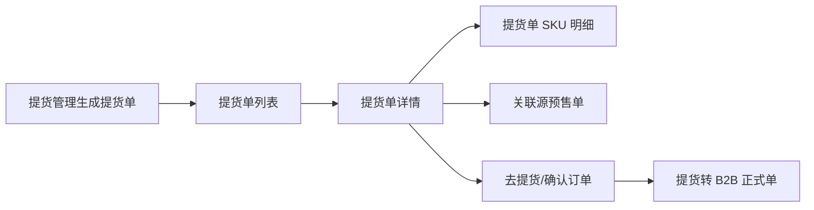

# Bmall Domain Flows

本文记录订货商城几个高频业务链路的接口调用和字段口径。重点服务于未来做数据探查、报表聚合、`bmall-cli report` 和 `source-explorer`。

## 柔供预售到提货

### 前台订货链路

关键接口：

| 步骤 | 接口 | 说明 |
| --- | --- | --- |
| 当前活动 | `/activity/mini/supply/presale/cfg/current` | 首页进入柔供活动的入口判断。 |
| 活动详情 | `/activity/mini/supply/presale/activity/query/detail` | 活动基础信息。 |
| 商品列表 | `/activity/mini/supply/presale/item/page` | 柔供商品/SKC 列表。 |
| 保存待提交 | `/activity/mini/supply/presale/order/save` | 保存柔供预售单。 |
| 待提交订单 | `/activity/mini/supply/presale/order/query/waiting/order` | 柔供购物车或待提交单。 |
| 提交 | `/activity/mini/supply/presale/order/submit` | 提交柔供预售单。 |
| 订单明细商品 | `/activity/mini/supply/presale/order/query/order/detail/item` | 源订单商品/SKC/SKU 明细。 |
| 关联提货单 | `/activity/pickup/orderRel/selectPickupOrders` | 从预售单看提货单。 |

重要字段：

| 字段 | 说明 |
| --- | --- |
| `activityType` | 柔供为 `2`。 |
| `pickupOrderSourceType` | 柔供来源为 `2`。 |
| `companyId` / `companyName` | 客户或门店。 |
| `itemCode` / `skcCode` / `skuCode` / `specId` | 商品层级字段。 |
| `orderQty` | 源预售单订货数量，小程序柔供加购结构里常见。 |
| `deliveryCfgList[].deliveryDate` | 柔供交期或配送日期配置。 |

### 中台管理链路

旧后台柔供活动批次和订单：

| 页面 | 接口 | 说明 |
| --- | --- | --- |
| `/flexibility_supply_order` | `/activity/supply/presale/activity/page` | 柔供活动批次列表。 |
| `/flexibility_supply_order_detail` | `/activity/supply/presale/activity/itemRel/pageGather` | 活动详情商品汇总。 |
| `/group_presale_list` | `/activity/supply/presale/order/page` | 柔供追单订单列表。 |
| `/group_presale_list` | `/activity/supply/presale/order/pageGather` | 柔供订单统计。 |

后台 v2 的柔供/补货链路：

| 页面 | 接口 | 说明 |
| --- | --- | --- |
| `/supplyPurchaseStock?iframe=1` | `/b2b/itemReplenishment/skc/page` | 补货/柔供商品库。 |
| `/supplyShopCart?iframe=1` | `/b2b/itemShopCart/orgCart/page` | 客户购物车视角。 |
| `/supplyShopCart?iframe=1` | `/b2b/itemShopCartSkcs/query/cart/skc` | 客户购物车 SKC 明细。 |

## 中短期预售到提货

关键接口：

| 步骤 | 接口 | 说明 |
| --- | --- | --- |
| 小程序活动详情 | `/activity/mini/presaleActivity/detail` | 中短期活动入口。 |
| 订货模型 | `/activity/mini/presaleActivity/orderModelList` | 可选模型。 |
| 订货规则 | `/activity/mini/presaleActivity/rules/byOrderModel` | 模型下规则。 |
| 商品全集 | `/activity/mini/presaleActivity/items/all` | 活动商品列表。 |
| 按规则商品 | `/activity/mini/presaleActivity/items/byOrderRule` | 规则筛选商品。 |
| SKU 规格 | `/activity/mini/presaleActivity/specList` | 加购规格。 |
| 提交预售单 | `/activity/presaleOrder/add` | 保存中短期预售单。 |
| 后台订单列表 | `/activity/presaleOrder/page` | 中短期订单分页。 |
| 后台订单统计 | `/activity/presaleOrder/orderStatistics` | 中短期订单汇总。 |
| 关联提货单 | `/activity/pickup/orderRel/selectPickupOrders` | 从中短期预售单看提货单。 |

后台 v2 中短期选购/购物车：

| 页面 | 接口 | 说明 |
| --- | --- | --- |
| `/midPurchaseStock?iframe=1` | `/activity/presaleActivitiesGoods/itemStore/skc/page` | 中短期选购 SKC 列表。 |
| `/midPurchaseStock?iframe=1` | `/activity/presale/activity/detailById` | 活动详情。 |
| `/midPurchaseStock?iframe=1` | `/activity/presaleShopCartSkus/batchAdd` | 加入购物车。 |
| `/midShopCart?iframe=1` | `/activity/presaleShopCart/orgCart/page` | 客户购物车视角。 |
| `/midShopCart?iframe=1` | `/activity/presaleShopCartSkcs/query/cart/skc` | 客户购物车 SKC 明细。 |
| `/midShopCart?iframe=1` | `/activity/presaleOrder/live/page` | 中短期订单列表。 |

## 提货单口径

### 提货单列表和详情

| 场景 | 接口 | 说明 |
| --- | --- | --- |
| 旧后台提货单列表 | `/activity/pickup/order/mgd/page` | 中台口径，适合管理侧数据探查。 |
| 旧后台提货单详情 | `/activity/pickup/order/mgd/detail` | 提货单主信息。 |
| 旧后台 SKU 明细 | `/activity/pickup/order/mgd/selectPickupOrderSkus` | 提货单 SKU 明细，是提货明细报表的重要接口。 |
| 小程序提货单列表 | `/activity/pickup/order/page` | 客户侧提货单列表。 |
| 小程序提货单详情 | `/activity/pickup/order/detail` | 客户侧提货详情。 |
| 小程序提货商品 | `/activity/pickup/order/orderItems` | 提货单商品。 |
| 去提货可选商品 | `/activity/pickup/order/orderItemsByGoPickup` | 去提货时可提商品。 |
| 提货确认页 | `/activity/pickup/order/orderConfirmDetail` | 确认订单信息。 |
| 提货确认 | `/activity/pickup/order/confirm` | 提货提交。 |
| 提货转 B2B 订单 | `/b2b/substitute/presale/pick/add` | 创建正式 B2B 销售单。 |

### 提货单状态和来源

| 字段 | 口径 |
| --- | --- |
| `pickupOrderStatus=1` | 待提货 |
| `pickupOrderStatus=2` | 已提货 |
| `pickupOrderStatus=3` | 部分提货 |
| `pickupOrderStatus=4` | 已拒绝 |
| `pickupOrderStatus=5` | 已取消 |
| `pickupOrderStatus=6` | 已拆分 |
| `pickupOrderSourceType=1` | 中短期 |
| `pickupOrderSourceType=2` | 柔供 |
| `pickupOrderSourceType=3` | 手动创建/预售提货，旧后台字典还有道具、辅料、工服、促销品、特卖、物料等扩展来源 |

### 提货率口径建议

客户 + SKC 维度提货率至少需要两个口径：

| 口径 | 分子 | 分母 | 适用 |
| --- | --- | --- | --- |
| 提货单口径 | 提货单明细中已提或本次提货数量 | 提货单明细中可提/待提/分配数量 | 看提货单执行情况。 |
| 原始订单口径 | 已提货数量或关联提货单累计提货数量 | 源预售单客户+SKC订货数量 | 看源订单履约情况。 |

已验证可组合接口：

| 数据 | 接口 | 备注 |
| --- | --- | --- |
| 提货单列表 | `/activity/pickup/order/mgd/page` | 支持用批次、来源类型筛选。 |
| 提货 SKU 明细 | `/activity/pickup/order/mgd/selectPickupOrderSkus` | 提货单口径明细。 |
| 提货关联源预售单 | `/activity/pickup/orderRel/selectPresaleOrders` | 从提货单回源订单。 |
| 柔供源订单明细 | `/activity/mini/supply/presale/order/query/order/detail/item` | 源订单口径，字段里可取 SKC/SKU/orderQty。 |
| 中短期源订单明细 | `/activity/mini/presaleActivity/queryItems/byOrderId` | 中短期源订单商品口径。 |

## 提货管理视角

提货管理和提货单不同。提货管理用于生成/分配提货单，天然包含活动、客户、商品三种视角。

| 来源 | 商品视角 | 客户视角 | 活动视角 |
| --- | --- | --- | --- |
| 中短期 | `/activity/presale/pickup/manage/itemView/getPage` | `/activity/presale/pickup/manage/companyView/dealerPage` | `/activity/presale/pickup/manage/activityView/page` |
| 柔供 | `/activity/supplyPresale/pickup/manage/itemView/getPage` | `/activity/supplyPresale/pickup/manage/companyView/dealerPage` | `/activity/supplyPresale/pickup/manage/activityView/page` |

生成提货单链路：

| 步骤 | 中短期 | 柔供 |
| --- | --- | --- |
| 选择活动 | `/activity/presale/pickup/manage/generateBillOfLading/getPage` | `/activity/supplyPresale/pickup/manage/generateBillOfLading/getPage` |
| 选择客户 | `/activity/presale/pickup/manage/generateBillOfLading/getCompanyPage` | `/activity/supplyPresale/pickup/manage/generateBillOfLading/getCompanyPage` |
| 选择源订单 | `/activity/presale/pickup/manage/generateBillOfLading/getPresaleOrderPage` | `/activity/supplyPresale/pickup/manage/generateBillOfLading/getPresaleOrderPage` |
| 确认分配 | `/activity/presale/pickup/manage/generateBillOfLading/confirmAllocationResult` | `/activity/supplyPresale/pickup/manage/generateBillOfLading/confirmAllocationResult` |
| 最终生成 | `/activity/presale/pickup/manage/generateBillOfLading/confirm` | `/activity/supplyPresale/pickup/manage/generateBillOfLading/confirm` |

## 客户 + SKC/SKU

### 购物车客户 + SKC

| 来源 | 客户视角接口 | SKC 明细接口 | 页面 |
| --- | --- | --- | --- |
| 柔供/补货 | `/b2b/itemShopCart/orgCart/page` | `/b2b/itemShopCartSkcs/query/cart/skc` | v2 `supplyShopCart` |
| 中短期 | `/activity/presaleShopCart/orgCart/page` | `/activity/presaleShopCartSkcs/query/cart/skc` | v2 `midShopCart` |

### 商品和库存

| 口径 | 接口 | 说明 |
| --- | --- | --- |
| 商品 SPU | `/product/itemGroup/scene/findSpuList` | 小程序商品列表。 |
| 商品 SKC | `/product/itemGroupDetail/scene/findSkcList` | 小程序商品列表。 |
| SKU 规格 | `/product/mini/item/spec/list` | 加购弹窗。 |
| 本店库存 | `/warehouse/itemstock/findStoreItemStock` | 后端库存服务。 |
| 总仓库存 | `/warehouse/itemstock/findGeneralItemStock`、`/warehouse/mini/itemstock/findGeneralItemStock` | 后端/小程序总仓库存。 |

### 新店报表客户 + SKC 参考

后台 v2 新店订单报表已经有客户维度和 SKC/SKU 维度接口，可作为未来设计“客户+SKC 提货率”报表的参考模型：

| 视角 | 接口 | 字段参考 |
| --- | --- | --- |
| 客户维度 | `/b2b/newStoreOrderSpu/report/distributor/page` | `companyIds`、`orgIds`、渠道筛选。 |
| SKC 维度 | `/b2b/newStoreOrderSkc/report/item/skc/page` | `skcCode`、`batchNo`、`canBePickCount`、`stockSatisfyRate`。 |
| SKU 展开 | `/b2b/newStoreOrderSkc/report/item/listSku/bySkcCode` | `skuCode`、`specId`。 |
| SKU 导出 | `/file/newStoreOrderSku/report/sku/export` | 导出样式可参考。 |

## 原始订单与正式 B2B 订单

提货相关链路会出现三个层次：

| 层次 | 示例接口 | 说明 |
| --- | --- | --- |
| 源预售单 | `/activity/mini/supply/presale/order/query/order/detail/item`、`/activity/mini/presaleActivity/queryItems/byOrderId` | 柔供/中短期源订单。 |
| 提货单 | `/activity/pickup/order/mgd/page`、`/activity/pickup/order/mgd/selectPickupOrderSkus` | 分配和提货执行单据。 |
| 正式 B2B 销售单 | `/b2b/substitute/presale/pick/add`、`/b2b/order/new/getOrderPageList` | 提货确认后创建或关联的销售单。 |

后端正式订单核心表：

| 表 | 说明 |
| --- | --- |
| `db2border` | B2B 订单主表。 |
| `db2bord1` | B2B 订单商品明细。 |
| `db2border_extend` | 订单扩展，包含 `source`、`source_name` 等来源字段。 |

提货/预售视图表：

| 表 | 说明 |
| --- | --- |
| `presale_pickup_order_rel` | 提货单与源预售单关系。 |
| `presale_pickup_activity_item_view` | 活动商品/SKC 提货视图。 |
| `presale_pickup_activity_company_view` | 活动客户提货视图。 |

## 后续 CLI 固化方向

建议把本知识包固化成 `bmall-cli` 的源码探查能力：

| 命令 | 输出 | 价值 |
| --- | --- | --- |
| `bmall source scan` | `bmall-code-knowledge.json` | 复跑四仓静态扫描。 |
| `bmall source endpoint --query pickup --repo backend` | 接口候选表 | 快速找接口、文件、行号。 |
| `bmall source flow pickup-customer-skc` | 链路说明 + 推荐接口组合 | 给报表开发或探查任务做入口。 |
| `bmall report pickup-customer-skc --source supply|mid|all` | JSON/CSV | 基于运行时接口输出客户+SKC 提货率。 |

`report pickup-customer-skc` 需要明确两个开关：

| 开关 | 含义 |
| --- | --- |
| `--source supply|mid|all` | 选择柔供、中短期或全部来源。 |
| `--basis pickup|source-order|both` | 区分提货单口径、原始订单口径或同时输出。 |
